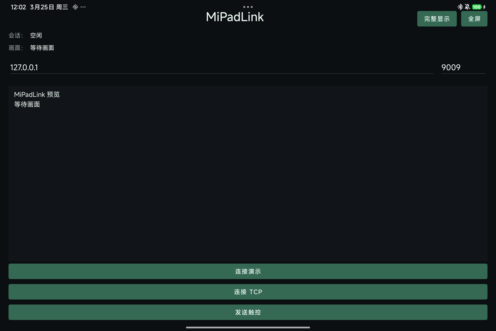
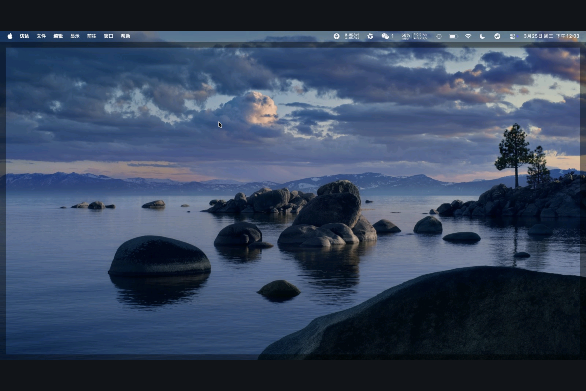

# MiPadLink

**中文** | [English](README.md)

把安卓平板通过 USB 线变成 macOS 的有线扩展屏。

MiPadLink 的核心思路是：在 Mac 上创建真实虚拟显示器，把画面通过 `adb reverse` 走 USB 传给安卓平板，再把平板触控输入回传给 macOS。当前项目主要围绕 Apple Silicon Mac 和 Android 10+ 平板验证，小米 Pad 7 是主验证设备。

<p align="center">
  
  
  
  
</p>

## 项目截图

### 安卓客户端界面



### 小米 Pad 7 的完整显示模式

`完整显示` 会保留整张 macOS 画面，避免 3:2 平板把左右内容裁掉。



## 这个项目能做什么

- 创建真实的 macOS 扩展屏，而不是单纯的视频镜像窗口
- 通过 `adb reverse` 走 USB 链路
- 把扩展屏画面推到安卓平板
- 把平板触摸回传到 macOS
- 自带本地 dashboard，可切换扩展/镜像、采集速度、重建虚拟屏

## 当前状态

MiPadLink 现在已经能用于实验、演示和轻量办公，但它仍然是工程原型，不是完全打磨好的消费级产品。

当前比较稳定的部分：

- `./start.sh` 一键启动
- `http://127.0.0.1:9010` 本地 dashboard
- 扩展屏 / 镜像切换
- 安卓端全屏预览
- 面向 3:2 平板的 `完整显示` 模式

当前已知限制：

- 目前还是 JPEG 推流，延迟和 CPU 占用后面还能继续优化
- 更准确的说法是“很多安卓平板可适配”，不是“所有平板都天然可用”
- 不同品牌 ROM 的后台限制、分辨率比例和触控行为仍可能不同

## 架构说明

```text
macOS host
  -> 创建虚拟显示器
  -> 抓取显示内容
  -> 在 TCP localhost:9009 提供画面
  -> 注入触控/鼠标输入

USB + adb reverse
  -> 把平板 localhost:9009 转回 Mac localhost:9009

Android client
  -> 连接 127.0.0.1:9009
  -> 解码 JPEG 帧
  -> 负责预览 / 全屏显示
  -> 把触摸坐标回传给 macOS
```

## 快速开始

### 1. 环境要求

Mac 端：

- macOS 13+
- Node.js 18+
- Xcode Command Line Tools

安卓平板端：

- Android 10+
- 已开启 USB 调试

### 2. 编译 macOS 原生 helper

```bash
./scripts/build-macos-helper.sh
```

### 3. 编译并安装安卓客户端

```bash
cd android-client
./gradlew :app:assembleDebug
adb install -r app/build/outputs/apk/debug/app-debug.apk
```

### 4. 一键启动

```bash
./start.sh
```

`./start.sh` 会自动做这些事：

- 查找或下载 `adb`
- 执行 `adb reverse tcp:9009 tcp:9009`
- 启动 host 服务
- 自动打开浏览器 dashboard

常用启动方式：

```bash
./start.sh
./start.sh performance
./start.sh balanced mirror
npm run start:pad
```

dashboard：

- 地址：[http://127.0.0.1:9010](http://127.0.0.1:9010)
- 可做的事：
  - 扩展屏 / 镜像切换
  - 采集速度档位切换
  - 重建虚拟显示器

### 5. 平板连接

在安卓客户端里：

1. 主机填 `127.0.0.1`
2. 端口填 `9009`
3. 点击 `连接 TCP`
4. 想保留完整桌面就用 `完整显示`
5. 想铺满屏幕就切到 `铺满裁切`

## 仓库导航

- [README.md](README.md)：英文版仓库说明
- [docs/device-setup.md](docs/device-setup.md)：设备配置细节
- [docs/troubleshooting.md](docs/troubleshooting.md)：常见问题排查
- [docs/release-notes.zh-CN.md](docs/release-notes.zh-CN.md)：中文发布说明草稿
- [docs/release-notes.en.md](docs/release-notes.en.md)：English release notes draft

## 兼容性说明

已经直接验证：

- 小米 Pad 7
- Apple Silicon 的 macOS 设备

理论上可扩展到：

- 很多 Android 10+ 平板，例如三星、联想、华为、OPPO、vivo 等

不能直接保证：

- 所有安卓平板都 100% 可用
- 所有厂商 ROM 都行为一致
- 所有屏幕比例都不用额外调参

## 路线图

- 换成 H.264 / HEVC 硬件编码
- 更细的延迟与性能统计
- USB 重插后的更稳重连
- 面向多品牌平板的兼容档位
- 预编译 APK 发布

## 许可

[MIT](LICENSE)
